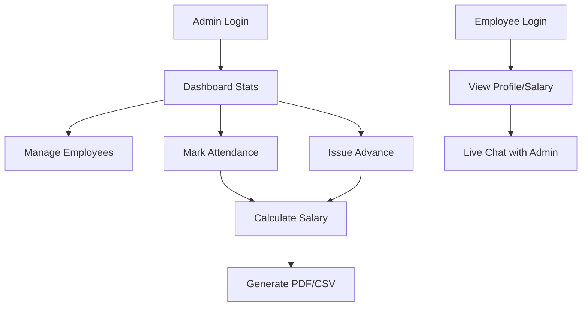

# 🚛 Transport Corporation: Workforce & Payroll Engine

<div align="center">
  
  
  
  
  
</div>

---

### 🌟 Project Vision
A comprehensive, full-stack ERP solution tailored for transport companies to manage their most valuable asset: **People**. This system automates the complex logistics of daily attendance, cash advances, and monthly payroll, ensuring absolute precision and transparency.

---

## 🚀 Key Features

### 🛠 Administrative Power
- **Smart Fleet Onboarding**: Seamlessly add employees with custom salary rates (Daily/Monthly) and detailed role profiling.
- **Precision Attendance**: A dual-view logistics board (Table/Card) to mark presence, absence, and exact working hours.
- **Advance Management**: One-click cash advance issuance with safe-guards against over-drafting and auto-deduction logic.
- **Verified Payroll**: Generate industrial-grade salary reports with auto-calculation of overtime, advance deductions, and net pay.
- **Attendance Trajectory**: A monthly calendar toggle to track individual employee performance, tasks done, and attendance patterns at a glance.
- **Multi-Tenant Architecture (SaaS)**: Built-in `orgId` isolation allowing multiple organizations to run independent operations on the same infrastructure.
- **Export Control**: Download monthly sync reports in **PDF** (Professional Slips) or **CSV** (Data Analysis).

### 👥 Personnel Experience
- **Personal Terminal**: Employees can log in to view their own attendance history, pending advances, and earnings.
- **Internal Sync**: A dedicated messaging hub with real-time polling to communicate with management.
- **Real-Time Operations**: Firebase-backed live attendance board and task updates for immediate visibility.
- **Advanced RBAC**: Granular dashboard access for **CEO, Manager, HR, and Accountant** roles.
- **Self Registration**: Mobile-responsive onboarding flow for new fleet members.

### 🎨 State-of-the-Art UI/UX
- **Adaptive Design**: Fully optimized for Mobile, Tablet, and Desktop.
- **Dark Mode**: High-contrast dark aesthetic synced with user preferences.
- **Live Widgets**: Real-time stats on dashboard showing "Active Units", "Fleet Size", and "Estimated Payroll".

---

## 🛠 Tech Stack

| Layer | Technologies |
| :--- | :--- |
| **Frontend** | React 18, Vite, Tailwind CSS, Lucide Icons, Framer Motion |
| **Backend** | Node.js, Express.js, JWT Authentication |
| **Database** | MongoDB Atlas (NoSQL) |
| **Utilities** | PDFKit (Report Generation), json2csv, js-cookie |
| **Deployment** | Vercel (Frontend), Render (Backend) |

---

## 📊 System Workflow



---

## ⚙️ Installation & Setup

### 1. Requirements
- Node.js (v16.0.0+)
- MongoDB Atlas Account

### 2. Physical Setup
```bash
# Clone the repository
git clone https://github.com/piyush3109/attandence-salary-app.git
cd attandence-salary-app

# Setup Backend
cd backend
npm install
# Create .env with: PORT, MONGODB_URI, JWT_SECRET

# Setup Frontend
cd ../frontend
npm install
# Create .env with: VITE_API_URL
```

### 3. Execution
```bash
# Run Backend (from /backend folder)
npm start

# Run Frontend (from /frontend folder)
npm run dev
```

---

## 📖 How To Use

#### 1. The Onboarding
- Admin logs in and creates the initial fleet list in the **Employees** tab.
- Set salary types: `Fixed Monthly` or `Daily Rate`.

#### 2. Daily Operations
- Use the **Attendance** hub every morning to mark present units.
- If an employee needs cash, use the **Advance** tab. It will be automatically deducted at the end of the month.

#### 3. Monthly Closing
- Navigate to the **Salary** section.
- Review the auto-calculated "Net Pay".
- Click **Export PDF** to hand out professional salary slips.

---

## 👨‍💻 Engineering Team

<table align="center">
  <tr>
    <td align="center">
      <a href="https://github.com/krishna3163">
        <br />
        <sub><b>Krishna Kumar</b></sub>
      </a><br />
      <small>Software Developer</small>
    </td>
    <td align="center">
      <a href="https://github.com/piyush3109">
        <br />
        <sub><b>Piyush Tiwari</b></sub>
      </a><br />
      <small>Product Engineer</small>
    </td>
  </tr>
</table>

<div align="center">
  <p><b>Built with passion in Lucknow, India 🇮🇳❤️</b></p>
  
</div>
